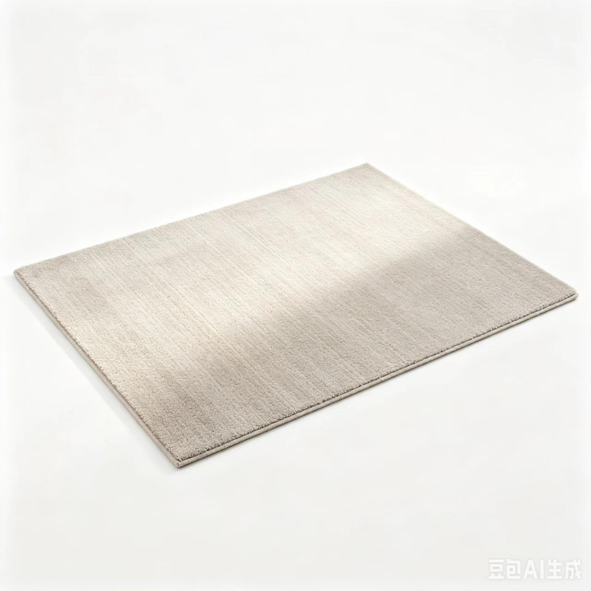

<div align="center">

# 🛍️ NideShop 微商城

**基于 ThinkJS + 微信小程序 + Docker 的全栈电商系统**

账号密码登录 · 微信公众号互通 · 一键容器化部署

</div>

---

## 📖 项目简介

NideShop 是一套完整的开源微信商城解决方案。本项目在原版 [NideShop](https://github.com/tumobi/nideshop) 基础上进行了二次开发，**将原有的微信授权登录改造为账号密码注册 / 登录系统**，并接入了微信公众号（测试号）实现 OAuth 网页授权登录、自动回复与菜单跳转，同时新增了 H5 移动端商城与后台管理界面，使用 Docker Compose 实现一键部署。

项目覆盖后端 API、微信小程序、H5 商城、后台管理、容器化部署全链路，均为独立开发实现。

### ✨ 核心特性

- 🔐 **账号密码登录系统** —— 替换原微信登录，支持注册 / 登录 / 改密 / 忘记密码重置，密码采用 bcrypt 加盐哈希
- 💬 **微信公众号互通** —— OAuth 网页授权、Token 校验、自动回复、自定义菜单，账号可绑定公众号
- 📱 **三端覆盖** —— 微信小程序、H5 移动商城、Web 后台管理，共用同一套后端 API
- 🐳 **一键 Docker 部署** —— MySQL + Node.js API + Nginx 编排，开箱即用
- 🔗 **cpolar 内网穿透** —— 无需公网服务器即可联调微信公众号测试号

---

## 🏗️ 系统架构

```
                    ┌─────────────────────────────────────────┐
                    │              浏览器 / 微信               │
                    │  H5商城  ·  后台管理  ·  公众号网页授权    │
                    └───────────────────┬─────────────────────┘
                                        │ HTTP
                    ┌───────────────────▼─────────────────────┐
                    │            Nginx (容器 :80)             │
                    │  静态资源托管 + /api · /admin-api 反向代理│
                    └──────┬──────────────────────┬───────────┘
                           │                      │
            ┌──────────────▼──────────┐  ┌────────▼─────────────┐
            │  mobile-html / admin-html│  │  Node.js API (:8360) │
            │   (Nginx 直接托管静态页) │  │      ThinkJS 3        │
            └─────────────────────────┘  └────────┬─────────────┘
                                                 │
                                       ┌─────────▼──────────┐
                                       │  MySQL 5.7 (:3307) │
                                       │  nideshop 数据库    │
                                       └────────────────────┘

   微信小程序(nideshop-mini-program) ──直连──▶ Node.js API (:8360)
```

---

## 🧩 技术栈

| 层级 | 技术 | 说明 |
|------|------|------|
| **后端 API** | Node.js · ThinkJS 3 · MySQL 5.7 | RESTful 接口，JWT token 鉴权 |
| **微信小程序** | 原生小程序 (WXML/WXSS/JS) | 21 个页面，覆盖完整购物流程 |
| **H5 移动商城** | 原生 HTML/CSS/JS | 单页应用，Nginx 托管 |
| **后台管理** | 原生 HTML/CSS/JS | 商品/订单/分类/品牌管理 |
| **部署** | Docker · Docker Compose · Nginx | 三容器编排 |
| **内网穿透** | cpolar | 公众号测试号联调 |
| **关键依赖** | bcryptjs · jsonwebtoken · request-promise · xml2js | 加密 / 鉴权 / 微信交互 |

---

## 📂 目录结构

```
nide shop 项目代码/
├── nideshop-master/                 # 🔧 后端 API (ThinkJS)
│   └── nideshop-master/
│       ├── src/
│       │   ├── api/controller/      # 小程序/H5 接口
│       │   │   ├── auth.js          #   账号注册/登录/改密
│       │   │   ├── wechat.js        #   公众号 OAuth/自动回复
│       │   │   ├── goods.js cart.js order.js pay.js ...
│       │   ├── admin/controller/    # 后台管理接口
│       │   └── common/config/       # 数据库/微信配置
│       ├── nideshop.sql             # 数据库初始化脚本
│       └── Dockerfile
│
├── nideshop-mini-program-master/    # 📱 微信小程序
│   └── nideshop-mini-program-master/
│       ├── pages/                   # 21 个页面
│       │   ├── auth/                #   登录注册(账号密码)
│       │   ├── index/ catalog/      #   首页/分类
│       │   ├── goods/ brand/        #   商品详情/品牌
│       │   ├── cart/ shopping/ pay/ #   购物车/下单/支付
│       │   ├── ucenter/             #   个人中心
│       │   └── topic/ comment/ ...
│       └── config/api.js            # 接口地址配置
│
├── mobile-html/                     # 🌐 H5 移动商城
├── admin-html/                      # 🖥️ 后台管理界面
├── docker/
│   └── nginx/nideshop.conf          # Nginx 配置
├── docker-compose.yml               # 🐳 一键部署编排
├── image/                           # 📸 项目截图与商品图
├── .env.example                     # ⚙️ 环境变量模板(脱敏)
├── start-wechat-demo.bat/.ps1       # 微信公众号演示一键启动
└── start.bat / start.sh             # Docker 启动脚本
```

---

## 🚀 快速开始

### 方式一：Docker Compose（推荐）

> ⚠️ 请务必使用 Docker 启动。**不要**用本地 `npm start` / `node development.js`，否则会连到本地 MySQL（`127.0.0.1:3306`），与 Docker 数据库（`localhost:3307`）不是同一个，导致数据"丢失"。

```bash
# 1. 克隆仓库
git clone https://github.com/zengmo20224/nide-shop-.git
cd nide-shop-

# 2. 复制环境变量模板并填写(公众号联调才需要)
cp .env.example .env

# 3. 一键构建并启动
docker compose up -d --build

# 4. 查看服务状态
docker compose ps
```

**Windows 用户**也可直接双击 `start.bat`。

启动后访问：

| 入口 | 地址 |
|------|------|
| 🌐 H5 商城 | http://localhost |
| 🖥️ 后台管理 | http://localhost/admin/ |
| 🔌 API 直连 | http://localhost:8360 |
| 🗄️ MySQL | localhost:3307 （root / nideshop123） |

### 方式二：微信公众号演示（Windows）

如需联调公众号测试号的 OAuth 登录、自动回复：

```text
双击运行：start-wechat-demo.bat
```

该脚本会自动：启动 Docker 三服务 → 复用/启动 cpolar `website` 隧道 → 校验本地 H5 与公众号回调接口 → 打印测试号需填写的 URL 和 Token。

在微信测试号后台填写：

```text
URL:   https://<你的cpolar域名>/api/wechat/verify
Token: nideshop
```

---

## 📸 项目展示

> 截图位于 [`image/`](./image) 目录，商品图片来源见 [`image/README_图片来源.md`](./image/README_图片来源.md)。

<table>
  <tr>
    <td width="50%" align="center"><b>H5 商城首页</b></td>
    <td width="50%" align="center"><b>商品分类</b></td>
  </tr>
  <tr>
    <td></td>
    <td></td>
  </tr>
  <tr>
    <td align="center"><b>商品详情</b></td>
    <td align="center"><b>购物车 / 下单</b></td>
  </tr>
  <tr>
    <td></td>
    <td></td>
  </tr>
</table>

---

## 🔑 核心功能清单

### 用户与认证（本项目改造重点）

| 接口 | 方法 | 说明 |
|------|------|------|
| `/api/auth/register` | POST | 账号密码注册（用户名 + 手机号唯一性校验） |
| `/api/auth/login` | POST | 账号密码登录（bcrypt 校验，签发 JWT） |
| `/api/auth/logout` | POST | 登出并失效 token |
| `/api/auth/changePassword` | POST | 修改密码 |
| `/api/auth/resetPassword` | POST | 忘记密码重置 |

### 微信公众号互通

| 接口 / 功能 | 说明 |
|------|------|
| `/api/wechat/verify` | 公众号 Token 接入校验 |
| `/api/wechat/oauthCallback` | OAuth 网页授权回调，绑定账号 |
| 自动回复 | 关注/消息事件自动回复 H5 链接 |
| 自定义菜单 | 跳转 H5 商城各频道 |

### 电商业务（小程序 + H5 共用）

- 🏠 **首页 / 分类** —— 频道入口、新品、热门、专题
- 👟 **商品** —— 详情、规格选择、关联推荐、品牌
- 🛒 **购物车** —— 加购、规格、数量、结算
- 📦 **订单** —— 下单、地址管理、支付、支付结果
- 💬 **互动** —— 专题、评论、评论发布、足迹、收藏

### 后台管理

商品上下架 · 分类管理 · 品牌管理 · 订单管理 · 专题管理 · 图片上传 · 用户管理

---

## ⚙️ 环境变量

复制 `.env.example` 为 `.env` 后填写（仅公众号联调需要）：

```env
WECHAT_OFFICIAL_APPID=        # 公众号/测试号 AppID
WECHAT_OFFICIAL_SECRET=       # 公众号/测试号 AppSecret
WECHAT_OFFICIAL_TOKEN=nideshop  # 公众号 Token(需与测试号一致)
WECHAT_OAUTH_REDIRECT_URL=    # OAuth 回调地址(cpolar 公网域名)
```

> 🔒 **安全提示**：`.env` 含真实密钥，已被 `.gitignore` 忽略，**切勿提交**。仓库只保留脱敏的 `.env.example`。

---

## 🗄️ 数据持久化

- MySQL 数据存储于 Docker 命名卷 `nideshop_mysql_data`
- `nideshop.sql` 仅用于**首次**初始化，之后数据都保留在卷中

```bash
# 安全停止（保留数据）
docker compose stop

# 再次启动
docker compose start

# 重建容器（保留数据）
docker compose up -d --build

# ⚠️ 危险：删除容器同时删除数据库（永久丢失数据）
docker compose down -v   # 除非要重置所有数据，否则不要加 -v
```

---

## 🛠️ 常用命令

```bash
docker compose up -d --build   # 构建并后台启动
docker compose ps              # 查看服务状态
docker compose logs -f api     # 查看 API 日志
docker compose stop            # 停止(保留数据)
docker compose start           # 启动已停止的服务
docker compose down            # 删除容器(保留数据卷)
```

### 部署成功校验

```bash
docker compose ps
curl http://localhost                   # H5 商城
curl http://localhost/admin/            # 后台
curl http://localhost:8360/admin/index/index
# 后台接口返回 401「请先登录」属正常，表示 API 可达、仅缺少鉴权
```

---

## 👤 作者

**zengmo20224** — 独立开发（全栈：后端 API · 微信小程序 · H5 · 后台 · 部署）

- GitHub：[@zengmo20224](https://github.com/zengmo20224)

---

## 📄 许可证

基于开源项目 [NideShop](https://github.com/tumobi/nideshop)（MIT License）二次开发。

商品图片来源：Pexels / Unsplash / Wikimedia Commons（详见 [`image/README_图片来源.md`](./image/README_图片来源.md)）。

---

<div align="center">

<sub>个人独立开发作品 · 基于 MIT 开源项目 NideShop 二次开发。</sub>

</div>
